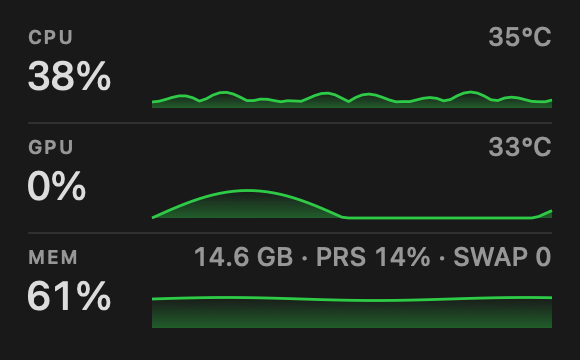

# carnival

A macOS menu-bar monitor that shows CPU, GPU and memory — and nothing else.



- **CPU** — load, sparkline, temperature
- **GPU** — load, sparkline, temperature
- **MEM** — used percentage, sparkline, used GB, memory pressure, swap
- `Launch at Login` toggle, `Quit`

Written in ~300 lines of Swift against AppKit and IOKit. No dependencies, no
settings window, no background daemon. Idle cost on an M4 Pro: 0.03% of one
core and 23 MB.

## Build

```sh
./build.sh
open carnival.app
```

`./tools/make-icon.sh` regenerates `carnival.icns`; the artwork is drawn in code,
there is no binary source asset to edit.

Requires the Xcode command line tools and macOS 26 or newer. The build ad-hoc
signs the bundle, so a copy downloaded from Releases needs its quarantine flag
cleared once:

```sh
xattr -dr com.apple.quarantine /Applications/carnival.app
```

Launch at Login records the bundle path, so after moving the app re-register it
from the new location:

```sh
/Applications/carnival.app/Contents/MacOS/carnival --login on
```

## Notes

The whole panel is one `NSView` with a hand-rolled `drawRect`, and history is a
fixed 60-slot ring buffer per metric, so the process allocates almost nothing
while running. Metrics come from `host_statistics`, `host_statistics64`,
`sysctl` and the `IOAccelerator` registry entry.

Temperatures use the private `IOHIDEventSystem` API — the only route to sensor
data on Apple Silicon. M1/M2 chips label their sensors (`pACC MTR Temp Sensor`,
`GPU MTR Temp Sensor`) and carnival reads those directly. M3 and newer expose 14
unlabeled `PMU tdieN` die sensors instead: under isolated CPU and GPU load they
heat within a degree of each other, so carnival reports the die hot spot as CPU
and the die average as GPU rather than inventing a mapping. Run
`carnival.app/Contents/MacOS/carnival --sensors` to dump the raw sensor list.
