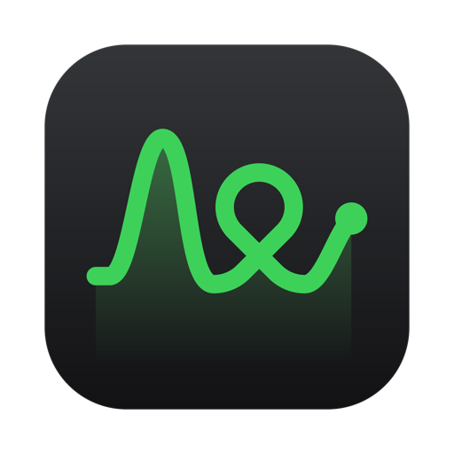
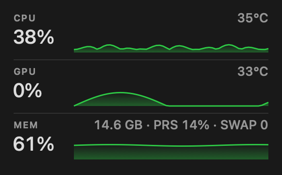

# carnival

A macOS menu-bar monitor that shows CPU, GPU and memory — and nothing else.



- **CPU** — load, sparkline, temperature
- **GPU** — load, sparkline, temperature
- **MEM** — used percentage, sparkline, used GB, memory pressure, swap
- `Launch at Login` toggle, `Quit`

Written in ~620 lines of Swift against AppKit and IOKit. No dependencies, no
settings window, no background daemon. With the menu closed it wakes one background
thread every 10 s for three system calls, and leaves the main thread asleep: idle CPU
is 20-40% below the previous build's, measured side by side
([numbers below](#how-it-stays-cheap)); that build measured 0.0024% of one core and
12 MB on an M4 Pro.

## Build

```sh
./build.sh
open carnival.app
```

`./tools/make-icon.sh` regenerates `carnival.icns`; the artwork is drawn in code,
there is no binary source asset to edit.

Requires the Xcode command line tools and macOS 27 or newer. The build ad-hoc
signs the bundle, so a copy downloaded from Releases needs its quarantine flag
cleared once:

```sh
xattr -dr com.apple.quarantine /Applications/carnival.app
```

Launch at Login records the bundle path, so after moving the app re-register it
from the new location:

```sh
/Applications/carnival.app/Contents/MacOS/carnival --login on
```

`tools/bench/run.sh [commit]` measures the working tree against `commit`: three copies
of each running side by side with the menu closed, then each one's menu opened and
closed in turn, and one sample timed in isolation. It prints CPU time by QoS, wakeups,
context switches, syscalls, redraws and memory as Markdown. The `bench` workflow runs
it on a GitHub macOS 26 runner (Actions → bench → Run workflow).

## How it stays cheap

Nobody is looking at the menu 99.9% of the time, and a timer wakeup costs ~284 us
whatever it does, so the tick runs every 10 s while the menu is closed and every 2 s
while it is open. Sparkline history advances on wall-clock rather than per tick, so
the two cadences never mix time scales; the window is a fixed 10 minutes. The CPU
figure is a delta of tick counters, so a sample taken too soon after another is noise
— the immediate tick on menu-open is suppressed if less than 0.4 s has passed.

The closed tick never touches the main thread. It runs on a thread of its own that
sleeps in `kevent` on a kqueue timer, with the same 25% leeway the run-loop timer had,
at background QoS — which Apple silicon runs on efficiency cores only. Waking the main
thread instead also runs every observer AppKit keeps on its run loop: ~4 context
switches a tick against ~1.3. A `DispatchSourceTimer` is no better, since libdispatch
wakes its manager thread before the worker: 744 timer wakeups an hour against 402.

A sample makes three system calls instead of seven. The host port is fetched once,
since `mach_host_self()` is a trap on every call; swap is read only while the menu is
open, through a fixed MIB, since `sysctlbyname` spends a syscall resolving the name;
and the GPU figure is read straight out of the `CFDictionary` instead of bridging all
of it to `[String: Any]`.

Temperatures are the expensive part: each sensor read blocks ~845 us waiting on the
PMU while burning ~45 us of CPU. The 42 `PMU tdie` clients are only 14 physical dies
exposed three times each, so a pass reads one client per die and re-reads only the
three hottest in full — 20 reads instead of 42, with the reported hot spot unchanged.
The whole pass runs on a utility queue, so the menu never blocks on it, and the HID
client behind it is created by the first pass rather than at launch.

Panel text is laid out once into cached `CTLine`s: laying out a string costs ~8 us and
drawing a laid-out one ~1 us, which takes `drawRect` down by 30% with byte-identical
output. A tick redraws only when a printed string, a tint or a sparkline changes, and
a tick that starts a temperature pass waits the ~17 ms for it so both land in one
redraw.

Measured with `tools/bench/run.sh` on a GitHub macOS 26 runner — a virtualised M1
with 3 cores, where every wakeup costs several times what it does on bare metal, so
compare the columns rather than these numbers with the M4 Pro's. Three copies of each
build ran side by side for 10 minutes with the menu closed; "AppKit alone" is this
build with its ticker never armed, the floor no tick can go below.

| per hour, menu closed | 1.4 | 1.5 | AppKit alone |
|---|---:|---:|---:|
| CPU time | 547 ms | 327 ms | 172 ms |
| context switches | 2304 | 1292 | 852 |
| Mach traps | 5358 | 2542 | 1404 |
| BSD syscalls | 3676 | 1140 | 780 |
| timer wakeups | 396 | 398 | 36 |
| memory footprint | 9.66 MB | 9.68 MB | 9.78 MB |

The tick itself — CPU time above the floor — went from 1040 us to 430 us. Across four
such runs the whole-process saving ranged from 20% to 40%. With the menu
open (three 40 s runs each) the panel redraws 26 times a minute instead of 31, and CPU
went from 0.23% to 0.18% of one core, inside the runs' spread.

Measured and rejected: `Timer.tolerance` and `DispatchSourceTimer` leeway change
nothing (0.0172% vs 0.0177%). Two more were rejected on the layer AppKit backed the
panel with and have not been tried again on the plain one below: a pre-rendered
gradient image was a 37% *regression* in a real menu window, and per-row invalidation
saved nothing because 83% of a redraw was the window surface flush — on the plain
layer `draw(_:)` is about a third of the open menu's CPU. Pre-rendering the gauge
symbol the menu bar used to show into a bitmap saved 7-19% of idle CPU and 0.2 MB —
the status bar seemed to re-render a symbol every time it redrew the item — but the
bitmap came out a shade lighter and a pixel narrower than the symbol the status bar
draws; `NSImage.cacheMode = .always` on the symbol changed nothing.

The item is now a path drawn in code, and pre-rendering that is rejected for the
opposite reason: bitmaps at 1x and 2x are byte-identical to the drawn glyph in every
appearance, and there is nothing left for them to save. The idle phase of
`tools/bench/run.sh` with three builds instead of two, 10 minutes on an M4 Pro under
macOS 27: an hour with the menu closed costs 87 ms of CPU with the symbol, 88 ms with
the drawn glyph and 87 ms with the pre-rendered one while the icon is on screen, and
85, 90 and 88 ms while it sits in the overflow behind the chevron — copies of one build
are up to 7 ms apart, and AppKit alone takes 1 ms. macOS 27 hosts the item in
MenuBarAgent and did not redraw it once in those 10 minutes; the drawing handler runs
once, ~400 us when the icon first comes on screen and never while it stays in the
overflow, and AppKit keeps the raster for later redraws. Pre-rendering moves that run
to launch and holds 0.3 MB more, 12.7 MB against 12.4 MB on screen. The symbol was the
heaviest of the three at 13.0 MB. The last SF Symbol, `power` on Launch at Login, is
gone too: macOS 27 does not show a menu item's image, the menu lays out the same
without it, checkmark on or off, and it cost up to 0.1 MB from launch.

The panel draws into a plain `CALayer`, not the layer AppKit would back the view with.
That one hands CoreAnimation a display list, which CoreAnimation renders with Metal
inside the process: 131-151 MB at the menu's first redraw and 23 MB left once it has
closed. The plain layer is a bitmap that `draw(_:)` fills on the CPU: 22 MB with the
menu open and 18 MB after, against ~17 MB for a menu with no panel in it. Three 40 s
runs each on the M4 Pro: the open menu goes from 0.55% to 0.18% of one core and from
68 to 14 mJ a minute at the same 32 redraws a minute, and idle stays where it was, 85
ms of CPU an hour either way. On screen the two differ by at most 3 levels out of 255,
in 399 of the panel's 208 800 pixels.

## Notes

The whole panel is one `NSView` with a hand-rolled `drawRect`, and history is a
fixed 60-slot ring buffer per metric, so the process allocates almost nothing
while running. Metrics come from `host_statistics`, `host_statistics64`,
`sysctl` and the `IOAccelerator` registry entry.

Temperatures use the private `IOHIDEventSystem` API — the only route to sensor
data on Apple Silicon. M1/M2 chips label their sensors (`pACC MTR Temp Sensor`,
`GPU MTR Temp Sensor`) and carnival reads those directly. M3 and newer expose 14
unlabeled `PMU tdieN` die sensors instead: under isolated CPU and GPU load they
heat within a degree of each other, so carnival reports the die hot spot as CPU
and the die average as GPU rather than inventing a mapping. Run
`carnival.app/Contents/MacOS/carnival --sensors` to dump the raw sensor list.
